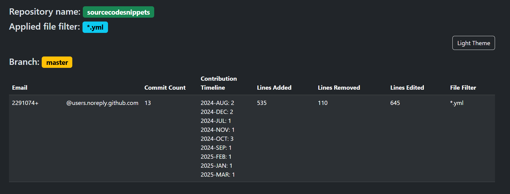

## About

Minimalistic CLI utility to analyze  Git history of a specified repository and generate HTML report detailing user contributions in each branch. 
The report includes:

-   Commit count
-   Contribution timeline (grouped by `week` or `month`)
-   Total lines added
-   Total lines removed
-   Total lines edited

The utility processes each branch in the repository and provides a summary report for each git branch.
The path to the Git repository is provided as a command-line argument. 
The output is saved as HTML file named `report_REPO-NAME_DATE_TIME.html`.

### CLI Parameters

Here are essential CLI parameters of the utility:

* `--repository` - Path to the git repository (directory or URL)
* `--filter` - Filter for file types (e.g., go, py, etc.). Optional
* `--mainbranch` - Name of the 'main' branch for merge-base (default "main")
* `--groupby` -  Group git log date by 'week' or 'month' (default "month")
* `--help` - Show help message 

**NOTE:** In order to fetch history of remote git branches, they must be pulled into local repository. This should be done automatically by the utility, if URL is used.

## Install: Run as CLI

**Dependencies:** `go` must be installed first. Latest version can be obtained and installed from [https://go.dev/doc/install](https://go.dev/doc/install).

Install
```
go install github.com/vdmitriyev/gogitstats@latest
```

**NOTE:** If utility has been installed as CLI, then use `gogitstats` instead of `go run .`

<details>

<summary>Install: Run with Go</summary>

## Install: Run with Go

1. Install Go:
    - If you don't have Go installed, download and install it from [golang.org](https://golang.org/dl/)
1. Clone the repository (or copy the code):
1. Run the executable:
    ```bash
    go run . --help
    ```
1. Generate a HTML report
    ```
    go run . --repository /path/to/your/git/repository
    ```

</details>

## Usage Examples

Generate a HTML report with the option `--repository`, which specifies the directory path to your Git repository or URL:

```bash
gogitstats --repository /path/to/your/git/repository
```

Generate a HTML report using `master` as a main branch (option `--mainbranch`) and consider only YAML files changes (option `--filter`)
```
gogitstats --repository ../sourcecodesnippets --mainbranch master --filter *.yml
```

### Screenshots of an Example Report 



## License

[MIT](LICENSE)